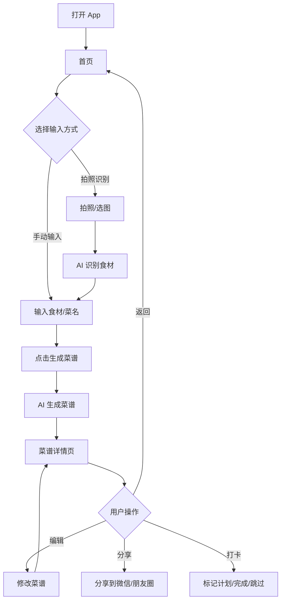
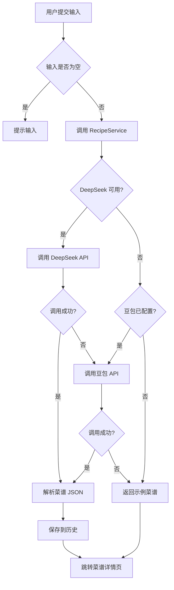
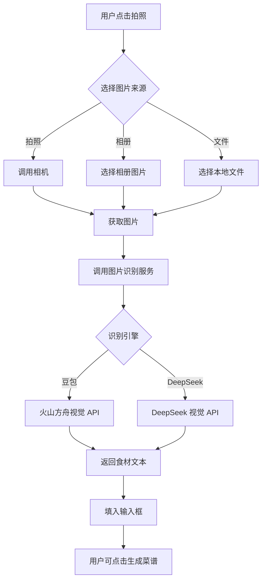
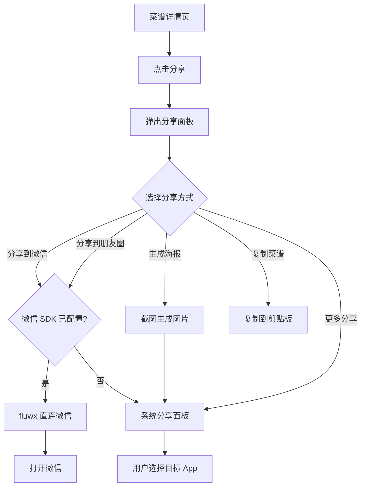
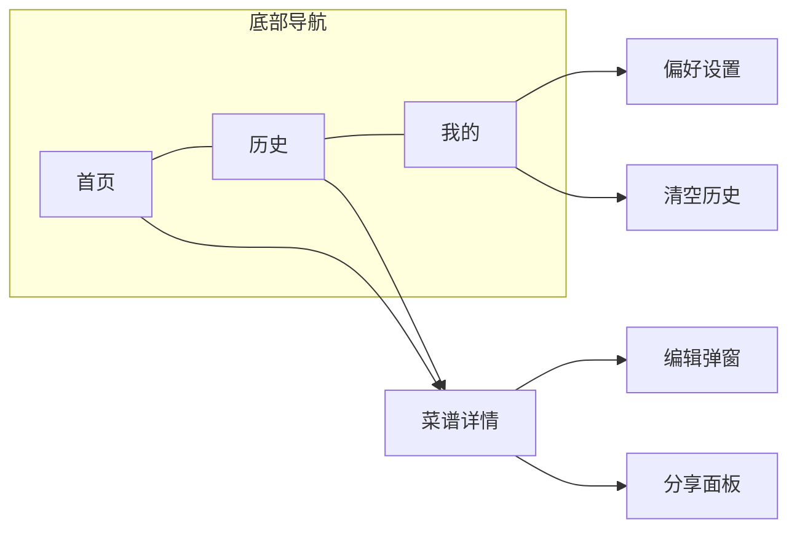
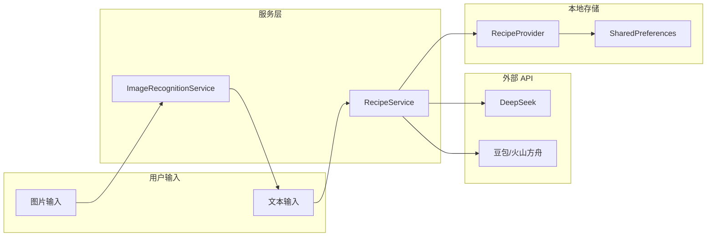

# 饮食助手 - 应用流程与设计说明

## 一、应用概述

**饮食助手（Food Tracker）** 是一款极简风格的饮食健康应用，通过 AI 根据用户输入的食材或想吃的菜名，自动生成菜谱及营养信息，支持拍照识别食材、分享到微信/朋友圈等功能。

---

## 二、应用整体架构

```
┌─────────────────────────────────────────────────────────────────┐
│                        饮食助手 App                               │
├─────────────────────────────────────────────────────────────────┤
│  首页(Home)     │   历史(History)    │    我的(Profile)           │
│  输入/拍照      │   菜谱列表/搜索    │   偏好设置/拍照识别切换     │
└────────┬────────┴────────┬──────────┴────────────┬──────────────┘
         │                 │                        │
         ▼                 ▼                        ▼
┌────────────────┐ ┌──────────────┐ ┌─────────────────────────────┐
│ 菜谱生成服务    │ │ 本地存储     │ │ 图片识别服务                 │
│ DeepSeek/豆包   │ │ 历史记录     │ │ 豆包/DeepSeek 视觉模型       │
└────────────────┘ └──────────────┘ └─────────────────────────────┘
```

---

## 三、主业务流程

### 3.1 用户主流程



### 3.2 菜谱生成流程



### 3.3 拍照识别食材流程



### 3.4 分享流程



---

## 四、页面导航结构



---

## 五、核心功能模块

| 模块 | 功能说明 |
|------|----------|
| **首页** | 大输入框输入食材/菜名；拍照/相册/文件选择图片进行 AI 食材识别；生成菜谱按钮；最近生成记录快捷入口 |
| **历史** | 按日期分组的菜谱列表；搜索；打卡状态筛选（计划中/已完成/已跳过）；点击进入详情 |
| **菜谱详情** | 菜名、营养评级、材料、步骤、环形进度条；编辑、删除、点赞、评论、分享 |
| **我的** | 菜系偏好、忌口设置；拍照识别引擎切换（豆包/DeepSeek）；清空历史；关于说明 |

---

## 六、数据流



---

## 七、交互设计要点

1. **输入方式多样**：支持手动输入、拍照、相册、文件选择，适配真机与模拟器
2. **加载反馈**：生成菜谱时显示 loading；识别食材时 SnackBar 提示「正在识别...」
3. **错误处理**：API 失败时自动回退示例菜谱，并提示用户
4. **分享便捷**：支持微信直连、系统分享、复制、生成海报多种方式
5. **打卡管理**：历史记录支持标记计划中/已完成/已跳过，便于饮食计划跟踪

---

## 八、如何导出为图片（用于审核上传）

如需将流程图导出为图片上传至审核平台：

1. **在线查看**：访问 `https://psrzhao1982.github.io/joeyn.github.io/flow.html`，流程图会自动渲染
2. **截图**：对每个流程图区域进行截图（Mac：Cmd+Shift+4；Windows：Win+Shift+S）
3. **或使用 Mermaid 在线编辑器**：将各流程图代码复制到 [Mermaid Live Editor](https://mermaid.live/)，导出为 PNG/SVG

---

*文档版本：1.0 | 更新日期：2025-03*
