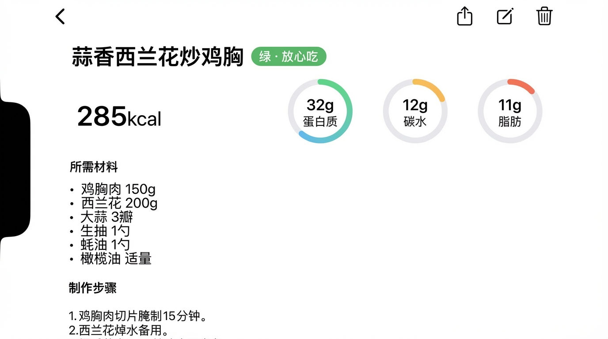

# GitHub Pages 说明

本目录用于部署应用官网：https://psrzhao1982.github.io/joeyn.github.io/

## 开启步骤

1. 将项目推送到 GitHub 仓库（如 `food_tracker`）
2. 仓库 Settings → Pages → Source 选择 **Deploy from a branch**
3. Branch 选 `main`，Folder 选 **/docs**
4. 保存后等待 1–2 分钟，访问 https://psrzhao1982.github.io/joeyn.github.io/

## 添加截图

将应用截图（建议 390×844 或类似比例）命名为 `screenshot1.png`、`screenshot2.png`、`screenshot3.png` 放入本目录，然后修改 `index.html` 中 `.screenshots` 部分：

```html
<div class="screenshots">
  
  
  
</div>
```

## 更新下载链接

测试阶段可保留「敬请期待」。有 TestFlight 或正式下载地址后，修改 `index.html` 中的：

```html
<a href="你的下载链接" class="download">下载 App</a>
```
